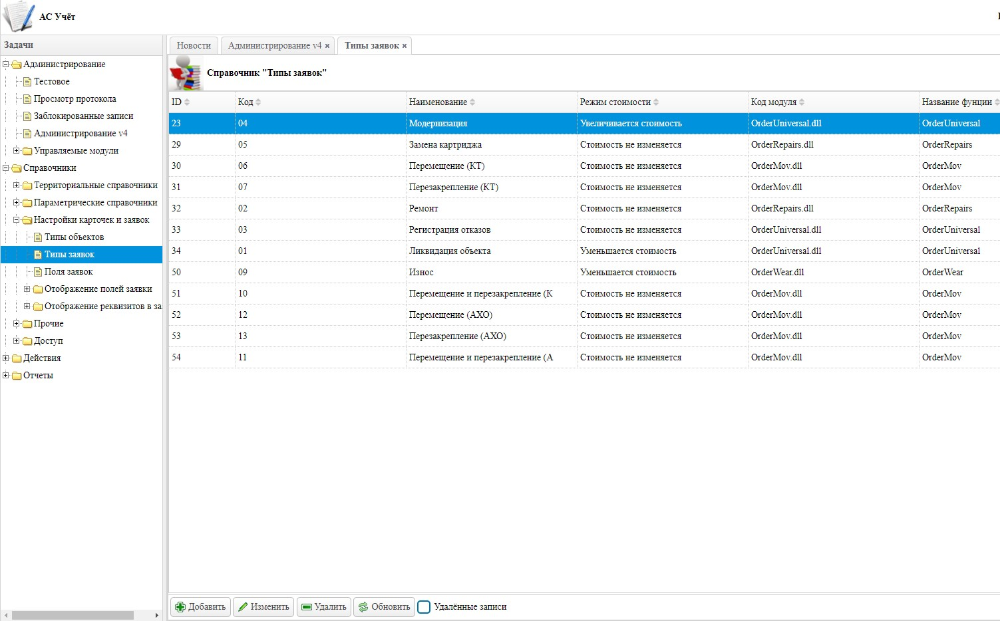

# Автоматизированная система "Учет"

### Автоматизированная система "Учет" предназначенна для решения следующих задач:
- Повышение эффективности и достоверности учета движения материальных ценностей;
- Контроль передвижения материальных ценностей из одного подразделения в другое;
- Улучшение контроля за составом, местонахождением и перемещением материальных ценностей;
- Уменьшение вероятности ошибок, вызванных «человеческим фактором»;
- Сокращение трудозатрат и временных издержек по учету движения материальных средств;
- Фиксирование материальной ценности за ответственным лицом;
- Возможность загрузки/выгрузки данных в формате EXCEL, Word, PDF

